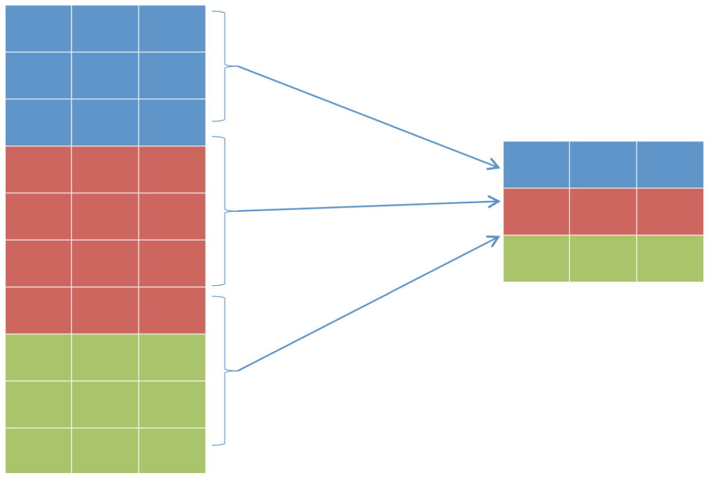
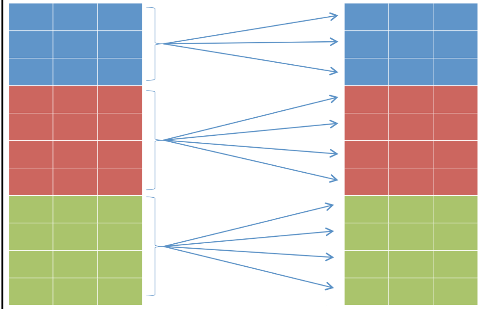
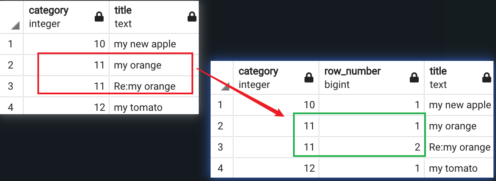
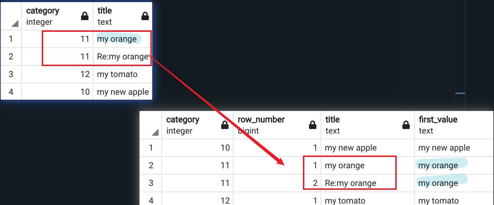
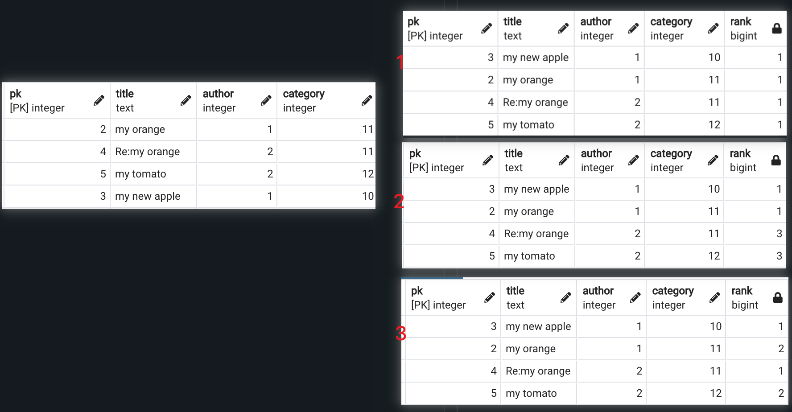
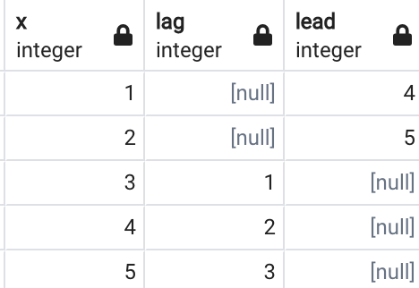
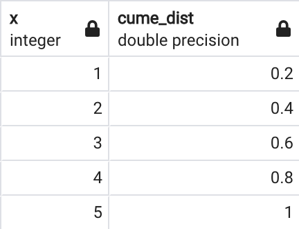
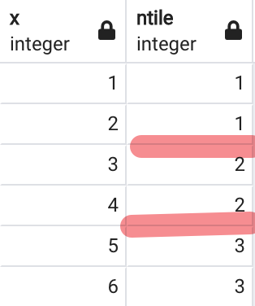

# Chapter 6: Window Functions

## The following topics are covered in this chapter:
* Using basic statement window functions 
* Using advanced statement window functions
<br></br>

## Using basic statement window functions
### Compare with a classic Group By query
Aggregation function behave in this way: The data is first sorted and then aggregated;


```sql
select category,count(*) 
from posts 
group by category 
order by category;
```

* What we have now is:
    index   | category | count
   ----|--------|--------
     1 | 10     | 1
     2 | 11     | 2
     3 | 12     | 1

Alternatively, we can use the window function
```sql
select category, count(*) over (partition by category) 
from posts 
order by category;
```
* What we have now is:
    index   | category | count
   ----|--------|--------
     1 | 10     | 1
     2 | 11     | 2
     3 | 11     | 2
     4 | 12     | 1
Window functions create aggregation without flattening the data into a single row. Instead, they replicate it for all the rows to which the grouping functions refer. 

Hence, the `distinct` key word is needed to get the same result as classic `group by` query


### Using the PARTITION BY function and WINDOW clause
```sql
select dictinct category, 
count(*) over (partition by category), 
count(*) over()
from posts
```

As we can see from the result,
1. The first window function aggregates the data using the category
field, 
2. The second one aggregates the data of the whole table.

It means **Using the window functions, it is possible to aggregate the data in different fields in the same query.**

index| category | count | count
----|--------|--------|--------|
1 | 10  | 1 | 4
2 | 11  | 2 | 4
3 | 11  | 2 | 4

We can also give alias (`window clause`) to the windows
```sql
select distinct category, count(*) over w1,
count(*) over W2 from posts
WINDOW w1 as (partition by category),W2 as ()
order by category;
```

### Introducing some useful functions
1. `ROW_NUMBER`: Assign a progressive number for each row within the partition
```sql
select category,row_number() over w,title
from posts 
WINDOW w as (partition by category) 
order by category;
```


2.`FIRST_VALUE`: returns the first value within the partition
```sql
select category,row_number() over w, title, first_value(title) over w
from posts 
WINDOW w as (partition by category order by category) 
order by category;
```


3.`LAST_VALUE`: returns the last value within the partition
```sql
select category, row_number() over w, title, last_value(title) over w
from posts
window w as (partition by category order by category)
order by category
```

4. `RANK` ranks the current row within its partition with gap
```sql
-- 1. correlation with itself
select pk,title,author,category,rank() over () from posts order by category;

-- 2. order by
select pk,title,author,category,rank() over (order by author) from posts

-- 3. order within partition
select pk,title,author,category,rank() over (partition by author order by category) from posts order by author;
```


5. `DENSE_RANK`: Similar as the `RANK` function, but return the rank number without gap
```sql
select pk,title,author,category,dense_rank() over (order by author) from posts order by category;
```

6. `LAG` and `LEAD`: offset the rows

```sql
-- generate a table from 1 to 5
select x from (select generate_series(1,5) as x) V;

 select x,lag(x,2) over w, lead(x,3) over w 
 from (select generate_series(1,5) as x) V 
 WINDOW w as (order by x) ;
```


7. `CUME_DIST`: calculates the cumulative distribution of value within a partition
```sql
select x,cume_dist() over w 
from (select generate_series(1,5) as x) V 
WINDOW w as (order by x) ;
```


7. `NTILE`: groups the rows sorted in the partition
```sql
select x,ntile(3) over w from (select generate_series(1,6) as x) V WINDOW w as (order by x) ;
```
