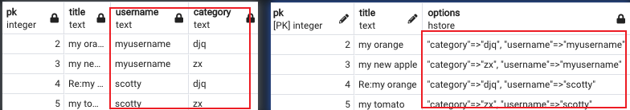
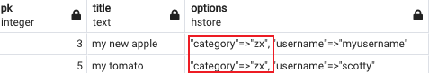
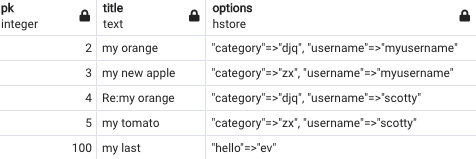
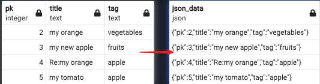
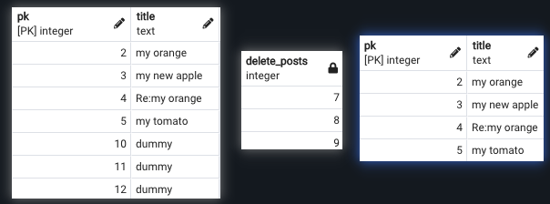

# Chapter 7: Server-Side Programming

## The following topics are covered in this chapter:
* Exploring data type
* Exploring functions and languages
<br></br>

## Exploring data type (The NoSQL data type)
### 1. HSTORE: store key-value pairs in a single value
```bash
forumdb=# create extension hstore;
```
#### 1.1 Store data as hstore type
```sql
select p.pk,p.title,
u.username, c.title as category 
from posts p
inner join users u on p.author=u.pk
left join categories c on p.category=c.pk
order by 1;


create table posts_options as
select p.pk,p.title,
hstore(ARRAY['username',u.username,'category',c.title]) as options
from posts p
inner join users u on p.author=u.pk
left join categories c on p.category=c.pk
order by 1;
```


#### 1.2 Query base on hstore column
```sql
select * from posts_options where options->'category' = 'zx';
```


1.3 Insert any key-value to the table without a pre-definition.
```sql
insert into posts_options (pk,title,options) values (100,'my last
   post','"hello"=>"ev"') ;
```


<br></br>

### 2. JSON
#### 2.1 A query to switch from a classic SQL to NoSQL representation
```sql
select row_to_json(q) as json_data 
from (
select p.pk,p.title,string_agg(t.tag,',') as tag from posts p
left join j_posts_tags jpt on p.pk=jpt.post_pk left join tags t on jpt.tag_pk=t.pk
group by 1,2 ) Q;
```


#### 2.2 Create a table with JSON column
```sql
-- create a table
create table post_json (jsondata jsonb);

-- insert json data
insert into post_json(jsondata) 
select row_to_json(q) as json_data 
from 
(select p.pk,p.title,string_agg(t.tag,',') as tag
 from posts p
left join j_posts_tags jpt on p.pk=jpt.post_pk
left join tags t on jpt.tag_pk=t.pk
group by 1,2 order by 1) Q;
trainline
-- browse the table
select jsonb_pretty(jsondata) from post_json 

-- query the table by condition
select jsonb_pretty(jsondata) from post_json 
where jsondata @> '{"tag":"fruits"}';

select jsonb_pretty(jsondata) from post_json 
where jsondata ->> 'title' LIKE '%orange%';
```

<br></br>

### 3. Exploring functions and languages
PostgreSQL is capable of executing server-side code in different language

The structure of a function
```sql
CREATE FUNCTION function_name(p1 type, p2 type,p3 type, ....., pn type)
    RETURNS type AS
$$
-- function logic;
$$
   LANGUAGE language_name;
```

#### 3.1 SQL Function
```sql
-- Structure 1
CREATE OR REPLACE FUNCTION my_sum(x integer, y integer) 
RETURNS integer AS
$$
SELECT x + y; 
$$ 
LANGUAGE SQL;

-- Structure 2
CREATE OR REPLACE FUNCTION your_sum(integer, integer) 
RETURNS integer AS 
$$
SELECT $1 + $2;
$$ 
LANGUAGE SQL;
```

* SQL functions returning a set of elements
```sql
-- To create the function
CREATE OR REPLACE FUNCTION delete_posts(p_title text) 
returns setof integer as 
$$
delete from posts where title=p_title 
returning pk;
$$
LANGUAGE SQL;

-- To verify the function
-- insert dummy posts
insert into posts(title,content,author,category) values('dummy','to be delete',1,11);
insert into posts(title,content,author,category) values('dummy','secret',1,11);
insert into posts(title,content,author,category) values('dummy','delete me',1,11);

-- call the function
select delete_posts('dummy');

-- verify the table
select pk,title from posts order by pk;
```


* SQL functions returning a table
```sql
-- create the function
create or replace function delete_posts(p_title text) 
returns table (ret_key integer,ret_title text) AS 
$$
delete from posts where title=p_title returning pk,title;
$$
language SQL;

-- To verify the function
-- insert dummy posts
insert into posts(title,content,author,category) values('dummy','to be delete',1,11);
insert into posts(title,content,author,category) values('dummy','secret',1,11);
insert into posts(title,content,author,category) values('dummy','delete me',1,11);

-- call the function
select * from delete_posts('dummy') 
```

#### 3.2 PL/pgSQL Function
```sql
CREATE OR REPLACE FUNCTION my_function(IN x integer,IN y integer, OUT w integer, OUT z integer) AS
$BODY$
BEGIN
w := x*y; 
z := x+y; 
END;
$BODY$
LANGUAGE 'plpgsql';
```